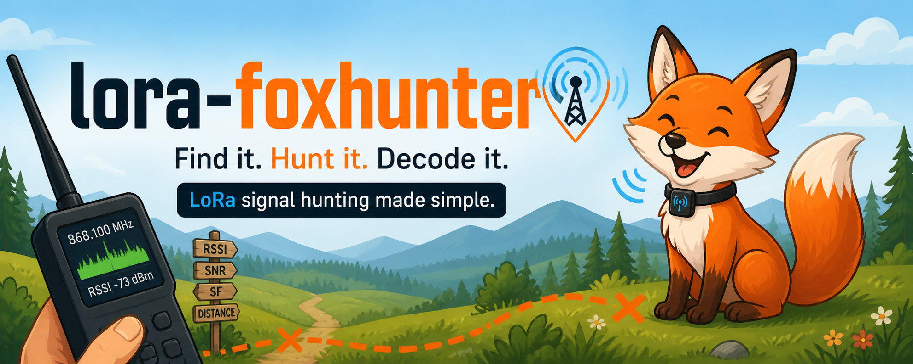
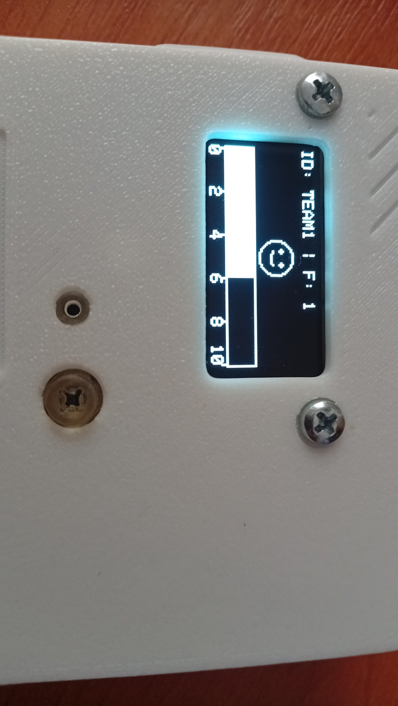
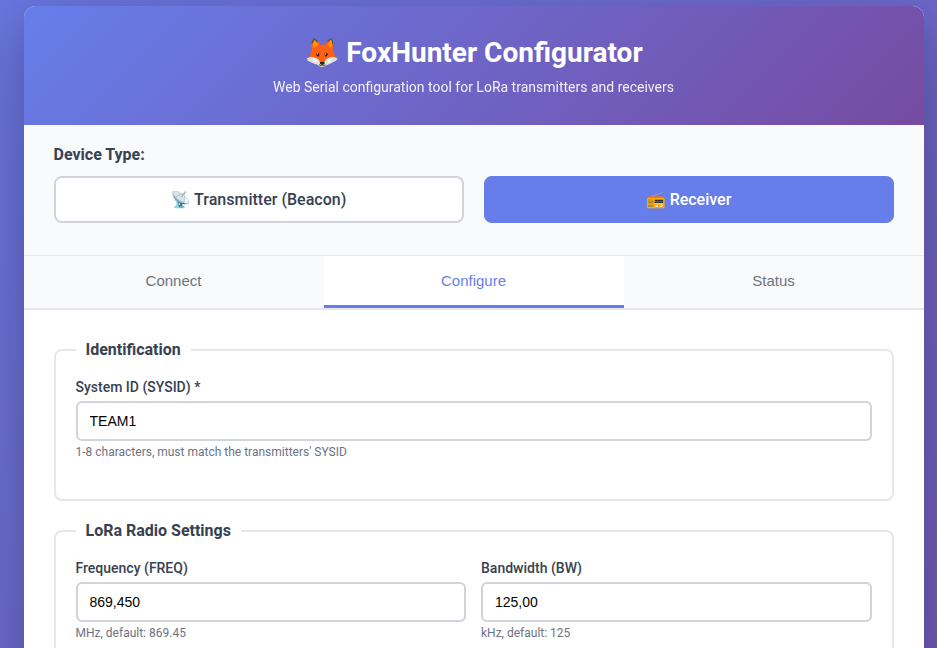

# FoxHunter

LoRa-based fox-hunting (radio direction finding) system.

Fox-hunting is a radio sport where participants use directional antennas to locate hidden transmitters ("foxes") by following the signal strength.
This project implements the transmitter and receiver firmware using affordable off-the-shelf hardware and the LoRa radio protocol.

---

## Components

### Beacon (transmitter)
- **Hardware:** Seeed XIAO nRF52840 + SX1262 LoRa module
- **Role:** Periodically broadcasts a short LoRa packet containing a system identifier and a fox number. Multiple beacons can operate simultaneously on the same frequency.
- **Build & documentation:** [beacon/README.md](beacon/README.md)

### Receiver
- **Hardware:** Seeed Wio Tracker L1 (nRF52840 + SX1262 + 1.3" OLED + joystick)
- **Role:** Listens for beacon packets, filters by system identifier, and displays the signal strength (RSSI) of the selected fox on the built-in OLED screen. The player navigates with the joystick to select which fox to measure.
- **Build & documentation:** [receiver/README.md](receiver/README.md)

### Configuration tools
- **Location:** `tools/`
- `configure_beacon.py` — Python CLI tool to configure a beacon over USB serial
- `configure_receiver.py` — Python CLI tool to configure a receiver over USB serial
- `web_configurator.html` — Web-based configurator using Chrome Web Serial API (single HTML file, no dependencies)

#### Web Configurator

Open `tools/web_configurator.html` in Chrome or Edge browser. The configurator provides a graphical interface to configure both beacons and receivers:

**Features:**
- Select device type (beacon/receiver) with radio buttons
- Connect to device via Web Serial API (no Python installation required)
- Read current configuration from device (`GET ALL`)
- Update parameters and save to flash memory (`SET` + `SAVE`)
- Reset device configuration (`RESET`)
- Real-time communication log

**Usage:**
1. Open `web_configurator.html` in Chrome/Edge
2. Select device type (beacon or receiver)
3. Click "Kapcsolódás eszközhöz" (Connect to device)
4. Choose the serial port (e.g., `/dev/ttyACM0`)
5. Click "Aktuális konfiguráció beolvasása" to read current settings
6. Modify parameters as needed
7. Click "Mentés eszközre" to save configuration

**Requirements:** Chrome 89+ or Edge 89+ (Web Serial API support)

---

## Radio protocol

Both devices use LoRa (SX1262) with matching parameters (default: 869.45 MHz, BW 125 kHz, SF 9, CR 5).
Each beacon packet is 9 bytes: an 8-byte null-padded ASCII system identifier followed by a 1-byte fox number.

---

## Acknowledgements

### MeshCore

The board definition files, linker scripts, and Wio Tracker L1 variant files (pin mappings) in this repository are derived from the [MeshCore](https://github.com/ripplebiz/MeshCore) project.
MeshCore is an open, packet-based LoRa mesh networking firmware — we borrowed their hardware support layer as a solid foundation so we didn't have to reinvent it.

> We love MeshCore ❤️

### MeshCore Hungary

This project is technically supported by the KözKapocs Association, the umbrella organization of Meshcore Hungary community.
🌐 [kozkapocs.hu](https://kozkapocs.hu)
🌐 [mc868.hu](https://mc868.hu)
